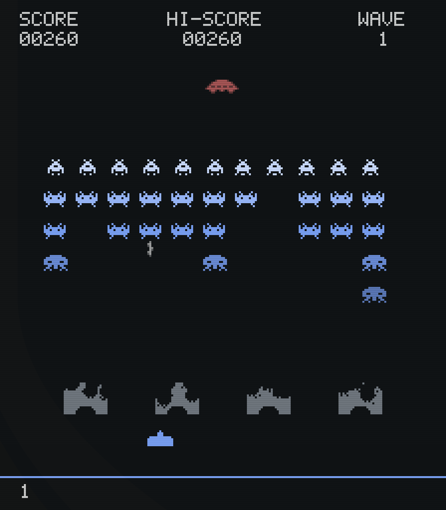

# Invaders

A faithful fixed-shooter in the spirit of the 1978 arcade classic, living in
your Omarchy bar: the 5×11 marching grid, the accelerating four-note
heartbeat, one bullet in the air at a time, bunkers that erode pixel by
pixel, and the mystery saucer — drawn as chunky 8-bit sprites in your
desktop's own colours. Change your theme and the invasion recolours itself
mid-wave, no restart.

The march speed is not a difficulty setting — it's the 1978 mechanism: one
alien moves per frame, so the fewer are left, the faster they come, down to
the last-alien sprint. The heartbeat is the same clock. That rhythm is the
whole game, and it has been kept exactly.



## Install

```bash
omarchy plugin add https://github.com/bottelet/omarchy-invaders
```

Say yes to enabling it and pick a spot on the bar, then click the 👾 to play.

Prefer a keyboard shortcut? Bind this in `~/.config/hypr/bindings.conf` (or
your `bindings.lua`):

```
bind = SUPER, I, exec, omarchy-shell shell toggle bottelet.invaders
```

Sound works out of the box — it plays through PipeWire (`pw-play`) or
PulseAudio (`paplay`), whichever your system already has, so there is nothing
to install. If the `qt6-multimedia` Qt module happens to be present it is used
automatically for lower-latency playback, but it is not required. Nothing is
ever installed on your behalf.

Other runtime tools, all stock on an Omarchy install: `python3` (the
high-score file is loaded through a single-descriptor bounded reader) and,
optionally, `jq` (one-time keybinding self-registration; skipped cleanly if
absent).

## Two modes

On the title screen, press **← →** to choose, then **Enter**:

- **Classic** — the faithful 1978 game. One bullet on screen at a time, the
  survivor-scaled march, the accelerating heartbeat. Nothing added, nothing
  "improved."
- **Modern** — the same core with roguelite juice: killed aliens sometimes
  drop a **power-up** you catch with the cannon (**R**apid fire, **3**-way
  spread, **P**ierce, **S**hield, extra **L**ife), a **combo multiplier** that
  builds with consecutive kills and resets if you whiff or get hit, multi-shot,
  and a **boss mothership every fifth wave** with a health bar.

## Playing

| Key | Action |
|-----|--------|
| **← →** or **A D** | Move the cannon (choose mode on the title screen) |
| **Space** | Fire — one bullet at a time in Classic; several in Modern |
| **P** | Pause (losing window focus also pauses) |
| **Esc** | Pause menu (resume / restart / quit); Esc again closes |
| **Enter** | Start, resume, and confirm your initials |
| **M** | Sound on/off |
| **F1** | Scanlines on/off |

Scoring: bottom rows 10, middle rows 20, top row 30, saucer 50–300
(its value follows how many shots you've fired — count them). Extra life
at 1,500. Each cleared wave restarts one row lower. In Modern, the combo
multiplier scales every point you score.

Closing the overlay pauses the game; summon it again and the wave is where
you left it.

## Settings

In the bar widget's settings: sound, scanlines, and starting lives (1–5).
That's all — the original's escalation is the difficulty design.

## Scores

Top ten, three-letter initials, kept in
`~/.local/state/omarchy-invaders/state.json`. Uninstalling the plugin leaves
your scores alone (they're your data); delete the directory if you want them
gone.

## Offline

No network access, ever. No telemetry, no leaderboards, nothing phones home.

## Legal

"Space Invaders" is a trademark of Taito Corporation. This plugin is an
original work in the spirit of the 1978 arcade game, not affiliated with or
endorsed by Taito, and it uses none of Taito's name, logos, or artwork: every
sprite was drawn for this project (`game/Sprites.js`) and every sound is
synthesized by a script in this repo (`audio/make_sounds.py`) — nothing is
sampled, copied, or traced from the original.

## Credits

The gameplay (engine, renderer, sprites, sounds) is original. The QML
integration layer — the sound plumbing (`game/Sound.qml`, `game/SoundBank.qml`)
and parts of the overlay/persistence scaffolding in `Panel.qml` — is derived
from [Quattroids](https://github.com/28allday/Quattroids) by Gavin Nugent,
used under the MIT License. Its conventions for shell overlays are excellent
and this plugin stands on them; see `LICENSE` for the attribution.

## Development

```bash
node --test tests/*.test.js   # engine + renderer + soak, no Qt needed
qs -p .                     # standalone cabinet without the shell
python3 audio/make_sounds.py  # regenerate the WAVs after editing a generator
```

## Uninstall

```bash
omarchy plugin remove bottelet.invaders
```

MIT licensed.
